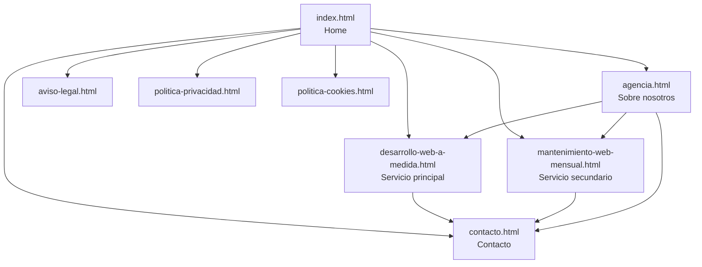

# Auditoría SEO Completa — Brummaa

**Fecha**: 25 de julio de 2026
**Sitio**: brummaa.com (análisis del código fuente del proyecto)
**Tipo de sitio**: Agencia de desarrollo web / negocio local (Córdoba, España)
**Páginas analizadas**: 8 (index, agencia, desarrollo-web-a-medida, mantenimiento-web-mensual, contacto, aviso-legal, politica-privacidad, politica-cookies)

---

## Resumen Ejecutivo

El sitio tiene una base técnica sólida (HTML semántico, responsive, buena estructura de navegación, meta tags en todas las páginas), pero presenta **carencias críticas** que limitan seriamente su visibilidad en buscadores:

> [!CAUTION]
> **Top 5 problemas críticos detectados:**
> 1. **Sin datos estructurados (Schema.org)** — Google no puede mostrar rich snippets (FAQ, LocalBusiness, precios)
> 2. **Sin `robots.txt` ni `sitemap.xml`** — Control de rastreo inexistente
> 3. **Sin etiquetas `canonical`** — Riesgo de contenido duplicado
> 4. **Sin Open Graph ni Twitter Cards** — Compartir en redes no muestra preview correcta
> 5. **Imágenes sin `loading="lazy"` ni dimensiones explícitas** — Impacto directo en CLS y rendimiento

> [!TIP]
> **Quick wins identificados (alto impacto, bajo esfuerzo):**
> - Añadir `robots.txt` y `sitemap.xml` → 15 minutos
> - Añadir `canonical` a todas las páginas → 20 minutos
> - Añadir `loading="lazy"` a imágenes below-the-fold → 15 minutos
> - Corregir la doble barra en la ruta de imagen de mantenimiento → 2 minutos

---

## 1. SEO Técnico

### 1.1 Crawlability e Indexación

| Elemento | Estado | Impacto |
|---|---|---|
| `robots.txt` | ❌ No existe | **CRÍTICO** |
| `sitemap.xml` | ❌ No existe | **CRÍTICO** |
| Etiquetas `canonical` | ❌ No existe en ninguna página | **ALTO** |
| Etiquetas `noindex` | ✅ No hay bloqueos accidentales | OK |
| `hreflang` | ⚠️ No aplica (sitio monolingüe) | N/A |

#### Problemas detectados

**❌ P1 — Sin `robots.txt`**
- **Impacto**: Google no tiene guía sobre qué rastrear. Sin referencia al sitemap.
- **Fix**: Crear `robots.txt` en la raíz del proyecto:
```
User-agent: *
Allow: /
Disallow: /openspec/
Disallow: /SKILLS/
Disallow: /Ficheros Proyecto/

Sitemap: https://brummaa.com/sitemap.xml
```

**❌ P2 — Sin `sitemap.xml`**
- **Impacto**: Google no descubre las páginas de forma eficiente. Para un sitio pequeño el impacto se mitiga por el enlazado interno, pero sigue siendo una señal SEO básica que falta.
- **Fix**: Crear `sitemap.xml` con las 8 páginas públicas, con `<lastmod>` y `<priority>`.

**❌ P3 — Sin etiquetas `canonical`**
- **Impacto**: Riesgo de contenido duplicado si el sitio es accesible con/sin `www`, con/sin trailing slash, etc.
- **Fix**: Añadir `<link rel="canonical" href="https://brummaa.com/pagina.html">` en el `<head>` de CADA página.

---

### 1.2 Velocidad y Core Web Vitals

| Factor | Estado | Notas |
|---|---|---|
| Google Fonts con `preconnect` | ✅ Correcto | `fonts.googleapis.com` + `fonts.gstatic.com` |
| Font Awesome con carga diferida | ✅ Bien implementado | `media="print" onload` + `<noscript>` fallback |
| GSAP cargado desde CDN | ⚠️ Render-blocking | Scripts al final del body, aceptable |
| `loading="lazy"` en imágenes | ❌ Solo en el iframe de Google Maps (contacto.html) | **ALTO** |
| `width`/`height` explícitos en imágenes | ⚠️ Solo en logos (70x70) | **ALTO** (CLS) |
| Formato de imágenes | ⚠️ Mezclado | WebP en algunas, JPEG/PNG sin optimizar en otras |
| CSS `fondo-animado.css` | ❌ **Referenciado pero NO EXISTE** | **ALTO** (404) |

#### Problemas detectados

**❌ P4 — CSS fantasma: `fondo-animado.css`**
- **Evidencia**: [index.html:31](file:///c:/Users/usuario/Desktop/Brummaa/index.html#L31) → `<link rel="stylesheet" href="css/fondo-animado.css">`
- **Archivo NO EXISTE** en `/css/`. Genera un error 404 silencioso en cada carga de la home.
- **Impacto**: Error 404 de recurso, bloquea brevemente el renderizado, afecta TTFB percibido.
- **Fix**: Crear el archivo o eliminar la referencia si los estilos están integrados en otro CSS.

**⚠️ P5 — Imágenes sin `loading="lazy"`**
- De ~27 `` en todo el sitio, solo el iframe del mapa en contacto usa `loading="lazy"`.
- Las imágenes del hero, carrusel, CTA, y mockups cargan todas en el initial paint.
- **Fix**: Añadir `loading="lazy"` a TODAS las imágenes que no sean parte del LCP (above-the-fold). Las imágenes hero del viewport NO deben tener lazy (correcto), pero los mockups, CTAs, FAQs y footer SÍ.

**⚠️ P6 — Imágenes sin dimensiones explícitas (CLS)**
- Las imágenes de hero, mockups y CTA no tienen `width`/`height` en el HTML.
- **Evidencia**: [agencia.html:85](file:///c:/Users/usuario/Desktop/Brummaa/agencia.html#L85), [desarrollo-web-a-medida.html:86](file:///c:/Users/usuario/Desktop/Brummaa/desarrollo-web-a-medida.html#L86), [mantenimiento-web-mensual.html:84](file:///c:/Users/usuario/Desktop/Brummaa/mantenimiento-web-mensual.html#L84), entre otras.
- **Impacto**: Contribuye directamente al CLS (Cumulative Layout Shift). Si la imagen tarda en cargar, el contenido salta.
- **Fix**: Añadir `width` y `height` reales a cada `` para que el navegador reserve espacio.

**⚠️ P7 — Formatos de imagen inconsistentes**
- Logo principal: `logo-brummaa.png` → **391 KB** para un logo de 70×70px. Excesivo.
- Imágenes hero en JPEG sin comprimir: `img-hero-ebo-estilistas.jpeg` (373 KB), `img-hero-mantenimiento-web-medida.png` (381 KB), `mockup-mobile-mantenimiento-web.png` (420 KB).
- Otras imágenes ya están en WebP optimizado (~70-80 KB). Bien.
- **Fix**: Convertir TODAS las imágenes a WebP. El logo debería ser SVG (vectorial, <5 KB).

**❌ P8 — Doble barra en ruta de imagen**
- [mantenimiento-web-mensual.html:84](file:///c:/Users/usuario/Desktop/Brummaa/mantenimiento-web-mensual.html#L84): `src="img//img-hero-mantenimiento-web-medida.png"` (doble `//`).
- Funciona en la mayoría de servidores, pero es un error que puede causar problemas en algunos hosting.
- **Fix**: Cambiar a `src="img/img-hero-mantenimiento-web-medida.png"`.

---

### 1.3 Mobile-Friendliness

| Factor | Estado |
|---|---|
| `<meta name="viewport">` | ✅ En todas las páginas |
| Diseño responsive | ✅ CSS con media queries |
| `apple-touch-icon` | ✅ 180×180 |
| `site.webmanifest` | ✅ Configurado |
| Favicon múltiple (ICO, SVG, PNG) | ✅ Completo |

> [!NOTE]
> Este apartado está **bien resuelto**. El sitio tiene buenas bases de mobile-friendliness.

---

### 1.4 Seguridad y HTTPS

| Factor | Estado |
|---|---|
| HTTPS | ⚠️ No verificable desde el código fuente (depende del hosting) |
| Enlaces externos con `rel="noopener noreferrer"` | ✅ Correcto en todos los `target="_blank"` |
| Contenido mixto | ✅ No detectado — todos los CDN son HTTPS |

---

### 1.5 Estructura de URLs

| Factor | Estado |
|---|---|
| URLs descriptivas y legibles | ✅ Excelente (`desarrollo-web-a-medida.html`, `mantenimiento-web-mensual.html`) |
| Keywords en URLs | ✅ Sí |
| Minúsculas y guiones | ✅ Consistente |
| Parámetros innecesarios | ✅ No hay |

> [!NOTE]
> La estructura de URLs es uno de los puntos más fuertes del sitio. Muy bien trabajada.

---

## 2. SEO On-Page

### 2.1 Title Tags

| Página | Title | Chars | Evaluación |
|---|---|---|---|
| index.html | `Brummaa — Diseño web en Córdoba para captar más clientes` | 62 | ✅ Excelente, keyword al inicio, CTA implícito |
| agencia.html | `Agencia — Brummaa: Tu socio tecnológico en Córdoba` | 56 | ✅ Bien |
| desarrollo-web-a-medida.html | `Brummaa — Desarrollo web a medida en Córdoba \| Webs orientadas a la conversión de clientes potenciales.` | **110** | ❌ **Demasiado largo**, truncado en SERP |
| mantenimiento-web-mensual.html | `Brummaa — Mantenimiento web mensual en Córdoba \| Protege tu sitio web` | 76 | ⚠️ Algo largo (>60), riesgo de truncado |
| contacto.html | `Contacto — Brummaa: Hablemos de tu negocio` | 49 | ✅ Bien |
| aviso-legal.html | `Aviso Legal — Brummaa` | 26 | ⚠️ Muy corto, oportunidad desaprovechada |
| politica-privacidad.html | `Política de Privacidad — Brummaa` | 37 | ✅ Aceptable para legal |
| politica-cookies.html | `Política de Cookies — Brummaa` | 34 | ✅ Aceptable para legal |

**❌ P9 — Title de desarrollo-web demasiado largo**
- **Fix**: Acortar a ~60 chars: `Desarrollo web a medida en Córdoba — Brummaa`

**⚠️ P10 — Inconsistencia en marca**
- Unas páginas usan "Brummaa" (con espacio) y otras "Brummaa" (sin espacio).
- **Fix**: Unificar a "Brummaa" en todos los titles.

---

### 2.2 Meta Descriptions

| Página | Chars | Evaluación |
|---|---|---|
| index.html | 172 | ⚠️ Algo largo (>160), riesgo de truncado |
| agencia.html | 153 | ✅ Bien |
| desarrollo-web-a-medida.html | 145 | ✅ Bien |
| mantenimiento-web-mensual.html | 176 | ⚠️ Largo |
| contacto.html | 139 | ✅ Bien |
| aviso-legal.html | 119 | ✅ Bien |
| politica-privacidad.html | 104 | ✅ Bien |
| politica-cookies.html | 99 | ✅ Bien |

> Todas las páginas tienen meta description. Bien. Solo ajustar longitud en index y mantenimiento.

---

### 2.3 Heading Structure (H1-H6)

**Cada página tiene exactamente un `<h1>`** ✅ — Correcto.

| Página | H1 | Problema |
|---|---|---|
| index.html | `Diseño web en Córdoba` (class `hero-pretitulo`) | ⚠️ **Semánticamente invertido** |
| agencia.html | `La agencia de desarrollo web en Córdoba enfocada en tu rentabilidad` | ✅ Excelente |
| desarrollo-web.html | `Desarrollo web a medida en Córdoba para multiplicar tus clientes` | ✅ Excelente |
| mantenimiento.html | `Mantenimiento web mensual para estar siempre visible` | ✅ Bien |
| contacto.html | `Hablemos de tu negocio. Contacta con Brummaa` | ✅ Bien |
| aviso-legal.html | `Aviso Legal` | ✅ Correcto |
| politica-privacidad.html | `Política de Privacidad` | ✅ Correcto |
| politica-cookies.html | `Política de Cookies` | ✅ Correcto |

**⚠️ P11 — H1/H2 invertidos en la home**
- [index.html:84-86](file:///c:/Users/usuario/Desktop/Brummaa/index.html#L84-L86): El `<h1>` es el **pretítulo** visual ("Diseño web en Córdoba") y el `<h2>` es el **título grande** visual ("webs a medida que generan clientes en automático").
- El H1 debería ser el texto visualmente más prominente y contener la keyword principal completa.
- **Fix**: Intercambiar — hacer `<h1>` el texto principal del hero y `<h2>` (o `<p>`) el pretítulo. O bien unificar en un solo H1.

---

### 2.4 Datos Estructurados (Schema.org / JSON-LD)

> [!CAUTION]
> **❌ P12 — CERO datos estructurados en todo el sitio**
> 
> No hay ningún `<script type="application/ld+json">` en ninguna página. Esto es probablemente el **hallazgo más impactante** de toda la auditoría.

**Lo que DEBERÍA tener Brummaa:**

| Schema | Página | Beneficio en SERP |
|---|---|---|
| `LocalBusiness` | index.html / contacto.html | Aparece en el Knowledge Panel local, Google Maps |
| `Organization` | todas | Logo, nombre, contacto en resultados de marca |
| `WebSite` + `SearchAction` | index.html | Sitelinks searchbox |
| `FAQPage` | index, desarrollo-web, mantenimiento | **Rich snippets de FAQs expandibles en SERP** |
| `Service` | desarrollo-web, mantenimiento | Describe servicios con precio |
| `BreadcrumbList` | todas | Muestra la ruta de navegación en resultados |
| `ContactPage` | contacto.html | Señal de entidad |
| `Person` | agencia.html | E-E-A-T (Rubén como fundador) |

**Impacto**: Sin schema, Google NO puede generar rich snippets para las FAQs (que tienen un contenido excelente), ni mostrar precios, ni saber que es un negocio local en Córdoba. Estás dejando de ocupar espacio visual en las SERPs.

---

### 2.5 Open Graph y Twitter Cards

> **❌ P13 — No hay Open Graph ni Twitter Cards en ninguna página**
> 
> Cuando alguien comparte brummaa.com en WhatsApp, LinkedIn, Twitter o Facebook, la preview será genérica o directamente no mostrará imagen.

**Fix**: Añadir a cada `<head>`:
```html
<meta property="og:title" content="...">
<meta property="og:description" content="...">
<meta property="og:image" content="https://brummaa.com/img/og-image.webp">
<meta property="og:url" content="https://brummaa.com/pagina.html">
<meta property="og:type" content="website">
<meta name="twitter:card" content="summary_large_image">
```

---

### 2.6 Imágenes y Alt Text

| Evaluación | Resultado |
|---|---|
| Todas las `` tienen `alt` | ✅ Sí |
| Alt text descriptivo | ✅ Buena calidad general |
| Alt text vacío (`alt=""`) | ✅ Ninguno |

> [!NOTE]
> Los alt texts están bien trabajados. "Desarrollo web a medida en Córdoba", "Rubén - Desarrollador Web y Fundador de Rubiq", etc. Buen trabajo aquí.

---

### 2.7 Enlazado Interno

| Factor | Estado |
|---|---|
| Navegación principal consistente | ✅ En todas las páginas |
| Footer con enlaces a servicios y legales | ✅ Completo y consistente |
| CTAs internos (a contacto, servicios) | ✅ Abundantes |
| Breadcrumbs | ❌ No implementados |
| Páginas huérfanas | ✅ No detectadas |

**⚠️ P14 — Sin Breadcrumbs**
- En un sitio de servicios, los breadcrumbs ayudan tanto al usuario como a Google a entender la jerarquía.
- **Fix**: Añadir breadcrumbs HTML + Schema `BreadcrumbList`. Ejemplo: `Inicio > Servicios > Desarrollo Web a Medida`.

---

### 2.8 Contenido Duplicado (interno)

**⚠️ P15 — Textos repetidos entre páginas**
- El párrafo sobre "Cero efecto rehén" aparece casi idéntico en index.html (sección beneficios, línea 154 Y sección servicios, línea 177) y en desarrollo-web-a-medida.html.
- Las secciones de precios muestran valores DISTINTOS entre páginas: en index dice 250€/400€, en desarrollo-web dice 200€/350€.
- **Impacto**: La discrepancia de precios es un problema de confianza (no solo SEO). Y el texto duplicado diluye la señal de relevancia.
- **Fix**: Unificar precios. Diferenciar el copy entre páginas para que cada URL tenga valor único.

---

## 3. Content Quality & E-E-A-T

### 3.1 Señales E-E-A-T

| Señal | Estado | Notas |
|---|---|---|
| **Experience** (Experiencia demostrada) | ⚠️ Parcial | Portfolio limitado (3 imágenes de proyectos en el carrusel hero, sin páginas de caso de estudio) |
| **Expertise** (Credenciales del autor) | ✅ Bien | Rubén identificado como fundador con foto y bio en [agencia.html](file:///c:/Users/usuario/Desktop/Brummaa/agencia.html#L107-L142) |
| **Authoritativeness** | ⚠️ Débil | "+10 proyectos" y "+1 año de experiencia" — son métricas muy bajas. Mejor omitir que mostrar números que debilitan autoridad |
| **Trustworthiness** | ✅ Bien | Aviso legal, privacidad, cookies presentes. Dirección y teléfono visibles. HTTPS (asumido) |

**⚠️ P16 — Métricas de autoridad que debilitan**
- [agencia.html:131-137](file:///c:/Users/usuario/Desktop/Brummaa/agencia.html#L131-L137): "+10 proyectos" y "+1 año de experiencia" puede jugar en contra. Un potencial cliente comparando agencias verá esos números como señal de inexperiencia.
- **Fix**: Considerar reformular ("Proyectos entregados" sin número exacto) o reemplazar por testimonios/resultados concretos.

---

### 3.2 Contenido de las FAQs

> [!TIP]
> **Punto fuerte del sitio**. Las 3 secciones de FAQ (index: 10 preguntas, desarrollo-web: 10 preguntas, mantenimiento: 10 preguntas) son contenido de ALTA calidad: respuestas largas, naturales, atacan objeciones reales del comprador, incluyen keywords long-tail de forma orgánica. Si se implementa Schema `FAQPage`, estas preguntas podrían aparecer expandidas directamente en los resultados de Google.

---

## 4. Arquitectura del Sitio

### 4.1 Mapa del Sitio



**Profundidad máxima**: 1 clic desde home → ✅ Excelente para crawlability.

### 4.2 Problemas de Arquitectura

**⚠️ P17 — Sin página de blog/contenido informativo**
- Un sitio de servicios locales sin blog no puede competir por keywords informativas ("cómo elegir diseñador web", "cuánto cuesta una web en Córdoba", etc.).
- **Fix**: Crear una sección de blog o artículos que alimente el embudo top-of-funnel con contenido educativo.

**⚠️ P18 — Sin páginas de caso de estudio / portfolio**
- Las 3 imágenes del carrusel hero (Team Rubén, Nutrifit, EBO Estilistas) no enlazan a ninguna parte. No hay páginas de caso de estudio.
- **Fix**: Crear páginas individuales por proyecto con: problema del cliente, solución implementada, resultados. Excelente para E-E-A-T y keywords long-tail.

---

## 5. Problemas Adicionales Detectados

### 5.1 Errores Técnicos Menores

**⚠️ P19 — Typo "desarollo" (falta una R)**
- [desarrollo-web-a-medida.html:139](file:///c:/Users/usuario/Desktop/Brummaa/desarrollo-web-a-medida.html#L139): `"Diseño y desarollo profesional"` → debería ser "desarrollo".
- [desarrollo-web-a-medida.html:158](file:///c:/Users/usuario/Desktop/Brummaa/desarrollo-web-a-medida.html#L158): Mismo typo repetido.
- [desarrollo-web-a-medida.html:290](file:///c:/Users/usuario/Desktop/Brummaa/desarrollo-web-a-medida.html#L290): `"...antes de pasar al desarollo"`.

**⚠️ P20 — `home.js` cargado en TODAS las páginas**
- [agencia.html:437](file:///c:/Users/usuario/Desktop/Brummaa/agencia.html#L437), [desarrollo-web-a-medida.html:414](file:///c:/Users/usuario/Desktop/Brummaa/desarrollo-web-a-medida.html#L414), [mantenimiento-web-mensual.html:482](file:///c:/Users/usuario/Desktop/Brummaa/mantenimiento-web-mensual.html#L482), [contacto.html:317](file:///c:/Users/usuario/Desktop/Brummaa/contacto.html#L317): Todas cargan `js/home.js` (10.8 KB).
- Si `home.js` contiene lógica específica de la home (carrusel, FAQ), se está cargando JS innecesario en páginas donde no se usa.
- **Fix**: Extraer la lógica compartida (nav hamburguesa, scroll-top, flotantes) a un `global.js` y dejar `home.js` solo para la home.

**⚠️ P21 — Comentario HTML huérfano en desarrollo-web y contacto**
- [desarrollo-web-a-medida.html:30](file:///c:/Users/usuario/Desktop/Brummaa/desarrollo-web-a-medida.html#L30): `<!-- AOS se añadirá al final del desarrollo -->`
- [contacto.html:29](file:///c:/Users/usuario/Desktop/Brummaa/contacto.html#L29): `<!-- AOS: Animate On Scroll -->`
- No hay AOS cargado en ninguna parte. Limpiar comentarios obsoletos.

---

## 6. Plan de Acción Priorizado

### 🔴 Prioridad 1 — Crítico (bloquea indexación/ranking)

| # | Acción | Esfuerzo | Impacto |
|---|---|---|---|
| P1 | Crear `robots.txt` | 15 min | Señal básica de crawlability |
| P2 | Crear `sitemap.xml` y enviar a Search Console | 30 min | Descubrimiento de páginas |
| P3 | Añadir `<link rel="canonical">` a todas las páginas | 20 min | Prevenir duplicados |
| P4 | Eliminar o crear `css/fondo-animado.css` | 5 min | Error 404 en cada carga de home |
| P12 | Implementar Schema JSON-LD (LocalBusiness, FAQPage, Organization) | 2-3 h | Rich snippets, knowledge panel |

### 🟠 Prioridad 2 — Alto impacto

| # | Acción | Esfuerzo | Impacto |
|---|---|---|---|
| P5 | Añadir `loading="lazy"` a imágenes below-the-fold | 20 min | LCP / rendimiento |
| P6 | Añadir `width`/`height` a todas las `` | 30 min | CLS |
| P7 | Convertir logo a SVG, imágenes JPEG/PNG a WebP | 1 h | Peso de página |
| P9 | Acortar title de desarrollo-web a ≤60 chars | 5 min | Visibilidad en SERP |
| P11 | Corregir jerarquía H1/H2 en la home | 10 min | Señal semántica |
| P13 | Añadir Open Graph + Twitter Cards | 30 min | Social sharing |
| P15 | Unificar precios entre páginas | 15 min | Confianza del usuario |

### 🟡 Prioridad 3 — Quick wins

| # | Acción | Esfuerzo | Impacto |
|---|---|---|---|
| P8 | Corregir doble barra `img//` en mantenimiento | 2 min | Correctitud |
| P10 | Unificar marca "Brummaa" vs "Brummaa" | 10 min | Consistencia |
| P19 | Corregir typos "desarollo" → "desarrollo" | 5 min | Profesionalidad |
| P20 | Separar `home.js` → `global.js` + `home.js` | 30 min | Rendimiento |
| P21 | Limpiar comentarios HTML huérfanos (AOS) | 5 min | Limpieza de código |

### 🔵 Prioridad 4 — Largo plazo (estratégico)

| # | Acción | Esfuerzo | Impacto |
|---|---|---|---|
| P14 | Implementar breadcrumbs + Schema BreadcrumbList | 1-2 h | Navegabilidad + SERP |
| P16 | Reformular métricas de autoridad en agencia.html | 30 min | E-E-A-T |
| P17 | Crear sección de blog con contenido educativo | Continuo | Keywords top-of-funnel |
| P18 | Crear páginas de caso de estudio / portfolio | 2-4 h | E-E-A-T + keywords long-tail |

---

## 7. SEO Off-Page (alcance limitado desde el código fuente)

No es posible auditar backlinks, autoridad de dominio ni menciones desde el código fuente. Para esto necesitaría:
- Acceso a Google Search Console
- Herramienta como Ahrefs, Semrush o Moz

**Recomendaciones generales off-page para un negocio local en Córdoba:**
1. **Google Business Profile**: Verificar y optimizar la ficha (horarios, fotos, categorías, reviews).
2. **Directorios locales**: Registrarse en páginas amarillas, Yelp España, directorios de Córdoba.
3. **NAP consistente**: Asegurar que Nombre, Dirección y Teléfono coinciden exactamente en todos los listados.
4. **Reviews**: Solicitar reseñas en Google a clientes satisfechos.
5. **Link building local**: Asociaciones de empresarios de Córdoba, cámaras de comercio, colaboraciones con otros negocios.

---

## 8. Resumen de Hallazgos por Severidad

| Severidad | Cantidad | Ejemplos principales |
|---|---|---|
| 🔴 Crítico | 5 | robots.txt, sitemap.xml, canonical, Schema, CSS 404 |
| 🟠 Alto | 7 | lazy loading, dimensiones img, formatos, OG tags, H1 invertido, precios inconsistentes |
| 🟡 Medio | 5 | typos, doble barra, marca inconsistente, JS innecesario, comentarios huérfanos |
| 🔵 Estratégico | 4 | breadcrumbs, blog, portfolio, métricas E-E-A-T |

**Puntos fuertes del sitio:**
- ✅ URLs excelentes, descriptivas y con keywords
- ✅ Meta descriptions en todas las páginas
- ✅ Un H1 por página (excepto problema semántico en home)
- ✅ Alt text de calidad en todas las imágenes
- ✅ Enlazado interno sólido y navegación consistente
- ✅ Responsive/mobile-first correctamente implementado
- ✅ Font Awesome con carga diferida (buena práctica)
- ✅ Contenido de FAQ de alta calidad con keywords long-tail naturales
- ✅ Páginas legales completas (aviso legal, privacidad, cookies)
