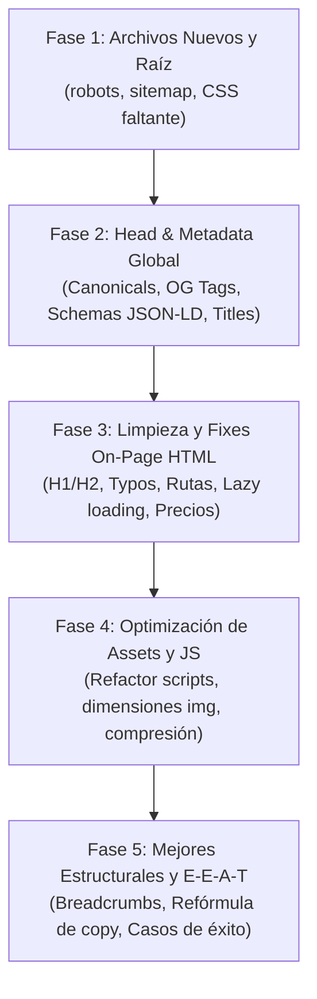

# Plan de Ejecución SEO Optimizado para IA — Brummaa

Este documento organiza los 21 hallazgos de la auditoría SEO en **5 fases secuenciales** estructuradas para que un modelo de IA ejecute las modificaciones de forma batch, rápida y con cero regresiones.

---

## 🎯 Mapa de Trabajo por Fases

---

## 🚀 Fase 1: Creación de Archivos Nuevos y Configuración de Raíz

> **Objetivo:** Resolver bloqueos críticos de rastreo y recursos 404 creando archivos independientes sin tocar HTML existente.

### Tarea 1.1: Crear `robots.txt`
- **Ubicación:** `c:\Users\usuario\Desktop\Brummaa\robots.txt`
- **Acción:** Crear archivo indicando reglas de rastreo y puntero al sitemap.

### Tarea 1.2: Crear `sitemap.xml`
- **Ubicación:** `c:\Users\usuario\Desktop\Brummaa\sitemap.xml`
- **Acción:** Incluir las 8 URLs públicas con fecha `<lastmod>` actualizada y prioridades.

### Tarea 1.3: Resolver CSS faltante `fondo-animado.css`
- **Ubicación:** `c:\Users\usuario\Desktop\Brummaa\css\fondo-animado.css`
- **Acción:** Crear el archivo con los estilos del fondo animado de la home (extraídos/asegurados) para corregir el error 404 en `index.html`.

---

## 🏷️ Fase 2: Metadatos y Estructura `<head>` en Batch

> **Objetivo:** Actualizar en lote los elementos del `<head>` en todas las páginas HTML.

### Tarea 2.1: Inyección de Etiquetas `<link rel="canonical">`
- **Archivos a modificar:** Las 8 páginas `.html`.
- **Acción:** Insertar canonical apuntando a dominio absoluto (`https://brummaa.com/pagina.html`).

### Tarea 2.2: Implementación de Open Graph y Twitter Cards
- **Archivos a modificar:** Las 8 páginas `.html`.
- **Acción:** Añadir meta tags `og:title`, `og:description`, `og:image`, `og:url`, `og:type` y `twitter:card`.

### Tarea 2.3: Inyección de Datos Estructurados (Schema JSON-LD)
- **Subtarea 2.3a:** `LocalBusiness` + `Organization` + `WebSite` → `index.html` y `contacto.html`.
- **Subtarea 2.3b:** `FAQPage` → `index.html`, `desarrollo-web-a-medida.html`, `mantenimiento-web-mensual.html`.
- **Subtarea 2.3c:** `Service` → `desarrollo-web-a-medida.html` y `mantenimiento-web-mensual.html`.

### Tarea 2.4: Optimización y Unificación de Titles & Descriptions
- **`desarrollo-web-a-medida.html`:** Acortar `<title>` a ~60 caracteres.
- **Todas:** Unificar nombre de marca a `"Brummaa"` en titles.
- **`index.html` y `mantenimiento-web-mensual.html`:** Ajustar `<meta name="description">` a ≤160 caracteres.

---

## 🧹 Fase 3: Edición de HTML Body y Corrección de Errores

> **Objetivo:** Corregir semántica, errores tipográficos, rutas de imágenes y atribute lazy loading.

### Tarea 3.1: Jerarquía Semántica H1/H2 en Home
- **Archivo:** `index.html`
- **Acción:** Intercambiar tags para que el título principal de hero sea `<h1>` y el pretítulo sea `<h2>` / span.

### Tarea 3.2: Unificación de Precios e Inconsistencias de Copy
- **Archivos:** `index.html` y `desarrollo-web-a-medida.html`.
- **Acción:** Sincronizar las tarjetas de precio para que muestren exactamente los mismos importes (Landing / Corporativa).

### Tarea 3.3: Corrección de Typos y Rutas
- **Archivo `desarrollo-web-a-medida.html`:** Corregir "desarollo" → "desarrollo" (líneas 139, 158, 290).
- **Archivo `mantenimiento-web-mensual.html`:** Corregir doble barra en la imagen hero (`img//img-hero...` → `img/img-hero...`).

### Tarea 3.4: Optimización de Imágenes Body (`loading="lazy"` + Dimensiones)
- **Archivos:** Todas las páginas `.html`.
- **Acción:**
  - Añadir `loading="lazy"` a imágenes por debajo del hero (mockups, CTAs, carrusel secundario).
  - Añadir atributos `width` y `height` explícitos a cada `` para erradicar el CLS.

### Tarea 3.5: Limpieza de Comentarios Obsoletos
- **Archivos:** `desarrollo-web-a-medida.html` y `contacto.html`.
- **Acción:** Eliminar comentarios HTML de librerías no usadas (`<!-- AOS ... -->`).

---

## ⚡ Fase 4: Refactorización de Scripts y Rendimiento de Assets

> **Objetivo:** Reducir carga innecesaria de JS y optimizar peso de imágenes principales.

### Tarea 4.1: Decoupling de `js/home.js`
- **Acción:** 
  1. Crear `js/global.js` con las funciones comunes (menú hamburguesa, scroll-top, botones flotantes).
  2. Mantener en `js/home.js` solo las animaciones GSAP específicas de la Home.
  3. Actualizar la carga de scripts en las páginas secundarias.

### Tarea 4.2: Optimización de Imágenes Pesadas
- **Acción:**
  - Reemplazar / optimizar `logo-brummaa.png` (391 KB) o convertir a SVG vectorial.
  - Comprimir imágenes JPEG/PNG principales de hero a formato WebP optimizado (<100 KB).

---

## 📈 Fase 5: Mejoras Estructurales y E-E-A-T (Largo Plazo / Estratégico)

> **Objetivo:** Reforzar autoridad de marca y navegación.

### Tarea 5.1: Breadcrumbs HTML + Schema
- **Acción:** Implementar componente de migas de pan semántico con su correspondiente Schema `BreadcrumbList` en páginas de servicios y legales.

### Tarea 5.2: Optimización de Métricas E-E-A-T en Agencia
- **Archivo:** `agencia.html`
- **Acción:** Reemplazar contadores numéricos frágiles (+10 proyectos / +1 año) por bloques enfocados en propuesta de valor y garantía técnica.

---

## 📋 Resumen de Ejecución para IA (Checklist Rápido)

| Fase | Archivos Afectados | Complejidad | Estimación IA |
|---|---|---|---|
| **Fase 1** | `robots.txt`, `sitemap.xml`, `css/fondo-animado.css` | Baja | 1-2 min |
| **Fase 2** | `*.html` (8 archivos) | Media (Head scripts/metas) | 3-5 min |
| **Fase 3** | `*.html` (8 archivos) | Media (Body edits & fixes) | 3-5 min |
| **Fase 4** | `js/*.js`, `img/*` | Media (Refactor JS) | 3-4 min |
| **Fase 5** | `agencia.html`, `desarrollo-web-a-medida.html` | Baja-Media | 2-3 min |
